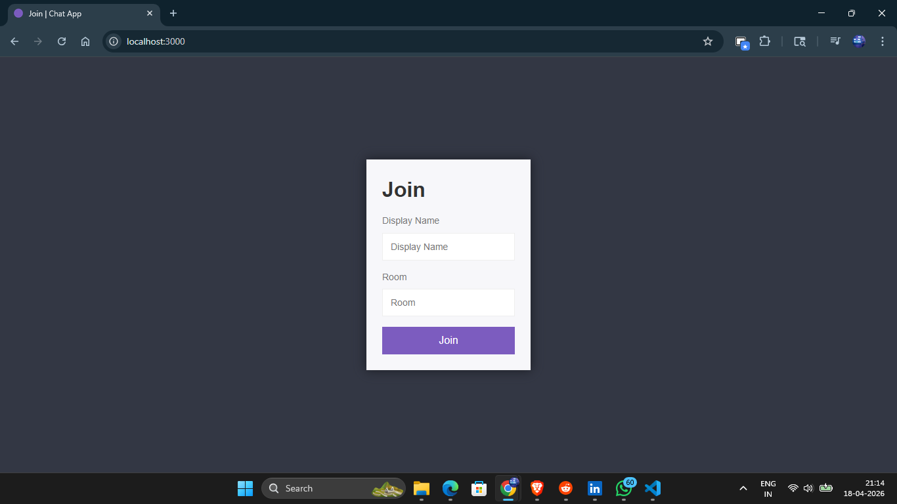
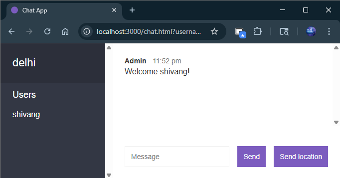
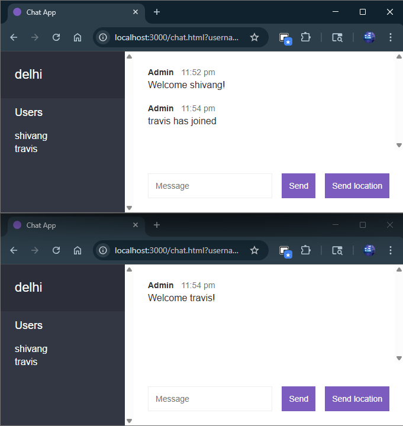
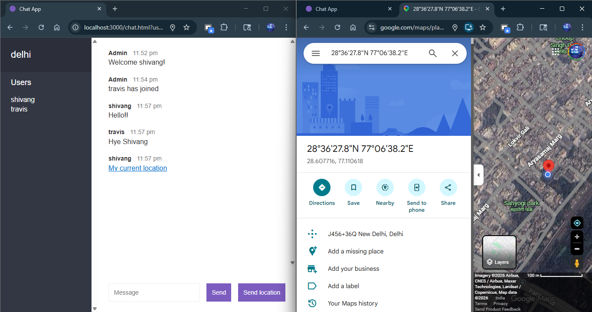

# Real-Time Chat App

A real-time chat application built with **Node.js**, **Express.js**, and **Socket.IO** that enables instant messaging in multiple rooms with live user presence updates.

## Features

* Real-time messaging using WebSockets
* Multiple chat rooms
* Join / leave notifications
* Active users sidebar
* Message timestamps
* Responsive frontend UI
* Clean client-server architecture

## Tech Stack

* Node.js
* Express.js
* Socket.IO
* HTML5
* CSS3
* JavaScript

## Project Structure

```bash
src/
  index.js
  utils/
    messages.js
    users.js
public/
  index.html
  chat.html
  css/
  js/
```

## Getting Started

### 1. Clone Repository

```bash
git clone https://github.com/shivangjhaa/Real-time-Chat-App.git
cd Real-time-Chat-App
```

### 2. Install Dependencies

```bash
npm install
```

### 3. Run Locally

```bash
npm run dev
```

### 4. Open in Browser

Visit: `http://localhost:3000`

## Available Scripts

* `npm start` → Run production server
* `npm run dev` → Run with nodemon

## Key Learnings

* Event-driven backend development
* WebSocket communication
* Real-time state management
* Handling connected/disconnected users
* Structuring scalable Node.js projects

## Screenshots

### Join Room Page


### Chat Interface


### Multiple Users in Room


### Location Sharing


## Suggested Improvements

* User authentication
* Private messaging
* MongoDB message persistence
* Typing indicators
* Better UI/UX
* Deployment with custom domain

## Author

**Shivang Jha**

* GitHub: [https://github.com/shivangjhaa](https://github.com/shivangjhaa)
* LinkedIn: [https://linkedin.com/in/shivang021](https://linkedin.com/in/shivang021)
